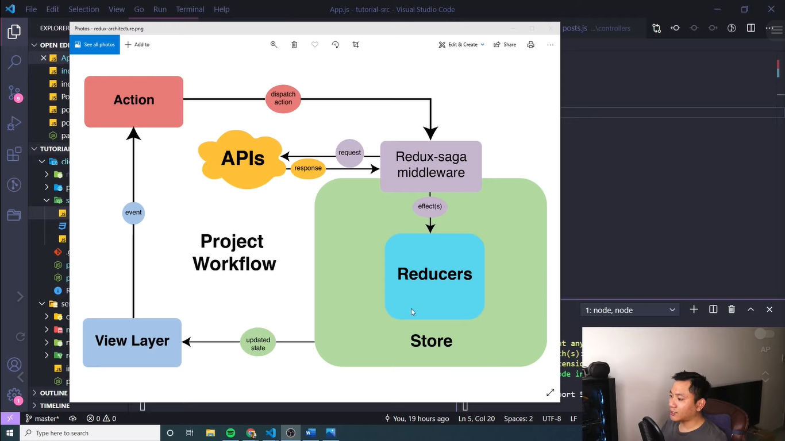

# Xây dựng và deploy ứng dụng MERN APP - Học Full Stack (React+Redux, NodeJS , Express, MongoDB)

Đây là flow của redu-saga. Redux-saga là 1 middleware. Action sẽ đưa các dữ liệu vào reducer, trong reducer thì nó sẽ có các logic để xử lý các action tương ứng. Khi xử lý xong thì store của chúng ta sẽ được cập nhật tương ứng với các đoạn logic mà chúng ta viết trong reducer

Thì redux-saga nó là 1 middleware, nó được nằm giữa Action và Reducer. Khi view thực hiện 1 action -> trước khi action này được đưa đến reducer thì nó sẽ thực hiện các side effect như là call api -> thì sau khi có dữ liệu từ api -> thì nó mới tiếp tục đưa dữ liệu này vào trong reducer -> và tiến hành cập nhật dữ liệu này trong store

Ở trong redux-saga thì có 1 khái niệm là effect. Và khi sử dụng redux-saga thì có rất nhiều effect -> chúng ta cùng tìm hiểu các effect đó là gì trong project này nhé

